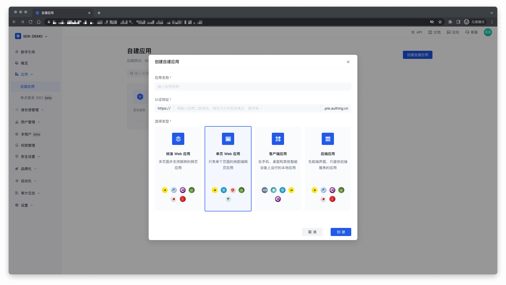
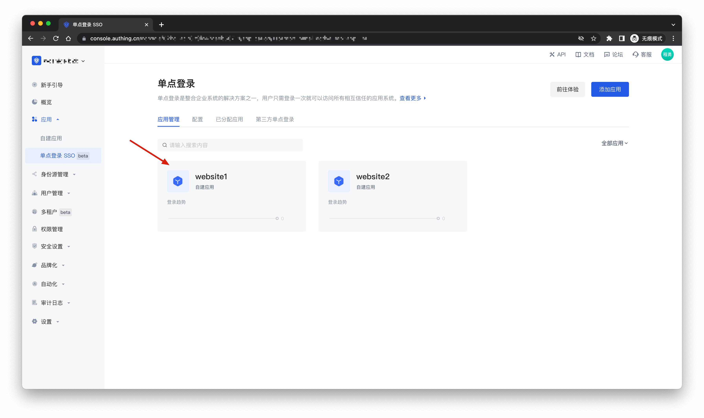
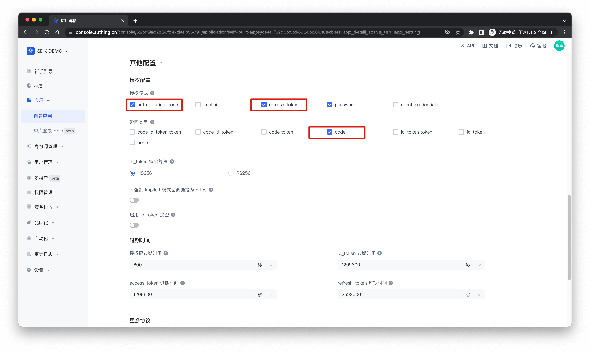
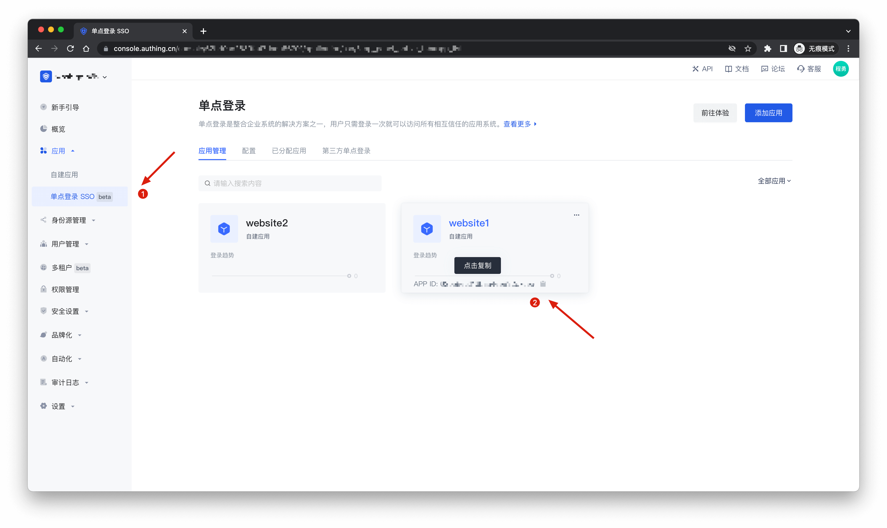
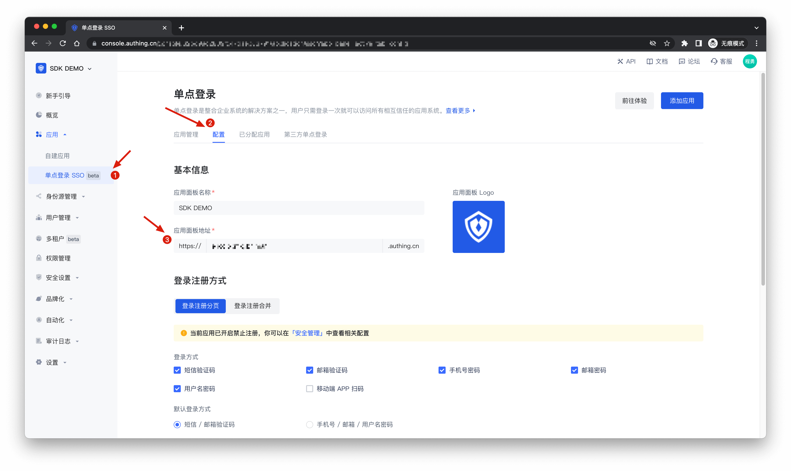

# authing-sso-demo-react

以下指南将逐步引导你如何使用 Authing Browser SDK，为你已有或新开发的 React 应用实现应用账号打通和单点登录，包括`登录`、`登出`、`展示用户信息`、`发起认证授权`等一系列认证能力。

## 创建自建应用

> 也可以使用现有应用

在控制台的「自建应用」页面，点击「创建自建应用」，应用类型选择「单页 Web 应用」，并填入以下信息：

- 应用名称：你的应用名称；
- 认证地址：选择一个二级域名，必须为合法的域名格式，例如 `my-spa-app`；




## 配置单点登录

> 参考 [自建应用 SSO 方案](https://docs.authing.cn/v2/guides/app/sso.html)

## 修改配置

找到刚刚配置好的应用，进入**应用配置**页面



- **认证配置**：配置 `登录回调 URL`
- **授权配置**：`授权模式`开启 `authorization_code`、`refresh_token`
- **授权配置**：`返回类型`开启 `code`

如下图所示：




点击保存进行保存配置，至此，配置完成

## 安装

Authing Browser SDK 支持通过包管理器安装、script 标签引入的方式的方式集成到你的前端业务软件。

### 使用 NPM 安装

```shell
$ npm install @authing/browser
```

### 使用 Yarn 安装

```shell
$ yarn add @authing/browser
```

### 使用 script 标签直接引入

```html
<script src="https://cdn.jsdelivr.net/npm/@authing/browser"></script>
<script>
const sdk = new Authing({
  // 很重要，请仔细填写！
  // 如果应用开启 SSO，这儿就要写单点登录的“应用面板地址”；否则填写应用的“认证地址”。
  domain: '认证域名',
  appId: '应用 ID',
  // 登录回调地址，需要在控制台『应用配置 - 登录回调 URL』中指定
  redirectUri: '登录回调地址'
});
</script>

```

## 初始化

### 应用 ID

如图所示：



### 认证域名

如图所示：



### 回调地址

根据你自己的业务填写回调地址，如图所示：


为了使用 Authing Browser SDK，你需要填写`应用 ID`、`认证域名`、`回调地址`等参数，如下示例：

```js
import { Authing } from '@authing/browser';

const sdk = new Authing({
  // 很重要，请仔细填写！
  // 如果应用开启 SSO，这儿就要写单点登录的“应用面板地址”；否则填写应用的“认证地址”。
  domain: '认证域名',
  appId: '应用 ID',
  // 登录回调地址，需要在控制台『应用配置 - 登录回调 URL』中指定
  redirectUri: '登录回调地址'
});
```

## 登录

Authing Browser SDK 可以向 Authing 发起认证授权请求，目前支持三种形式：

1. 在当前窗口转到 Authing 托管的登录页；
2. 弹出一个窗口，在弹出的窗口中加载 Authing 托管的登录页。
3. 静默登录

### 跳转登录

下面的代码演示了如何使用跳转登录：

```tsx{22-27}
import React, { useCallback, useEffect, useMemo, useState } from 'react';
import { Authing } from '@authing/browser';
import type { LoginState } from '@authing/browser/dist/types/global';

function App() {
  const sdk = useMemo(() => {
    return new Authing({
      // 很重要，请仔细填写！
      // 如果应用开启 SSO，这儿就要写单点登录的“应用面板地址”；否则填写应用的“认证地址”。
      domain: '单点登录的“应用面板地址”',

      // 应用 ID
      appId: '应用 ID',

      // 登录回调地址，需要在控制台『应用配置 - 登录回调 URL』中指定
      redirectUri: '登录回调 URL',
    });
  }, []);

  const [loginState, setLoginState] = useState<LoginState | null>();

  /**
   * 以跳转方式打开 Authing 托管的登录页
   */
  const login = () => {
    sdk.loginWithRedirect();
  };

  /**
   * 获取用户的登录状态
   */
  const getLoginState = useCallback(async () => {
    const state = await sdk.getLoginState();
    setLoginState(state);
  }, [sdk]);

  useEffect(() => {
    // 判断当前 URL 是否为 Authing 登录回调 URL
    if (sdk.isRedirectCallback()) {
      /**
       * 以跳转方式打开 Authing 托管的登录页，认证成功后，需要配合 handleRedirectCallback，
       * 在回调端点处理 Authing 发送的授权码或 token，获取用户登录态
       */
      sdk.handleRedirectCallback().then((res) => setLoginState(res));
    } else {
      getLoginState();
    }
  }, [getLoginState, sdk]);

  return (
    <div className="App">
      <p>
        <button onClick={login}>login</button>
      </p>
      <p>
        <code>{JSON.stringify(loginState)}</code>
      </p>
    </div>
  );
}

export default App;
```

如果你想自定义参数，也可以对以下参数进行自定义传参，如不传参将使用默认参数

```js
const login = () => {
  const params: {
    // 回调地址，默认为初始化参数中的 redirectUri
    redirectUri?: string;

    // 发起登录的 URL，若设置了 redirectToOriginalUri 会在登录结束后重定向回到此页面，默认为当前 URL
    originalUri?: string;

    // 即使在用户已登录时也提示用户再次登录
    forced?: boolean;

    // 自定义的中间状态，会被传递到回调端点
    customState?: any;
  } = {
    redirectUri: '回调地址',
    originalUri: '发起登录的 URL',
    forced: false,
    customState: {},
  }
  sdk.loginWithRedirect(params);
};
```

### 弹出窗口登录

你也可以在你的业务软件页面使用下面的方法，通过弹出一个新窗口的方式让用户在新窗口登录：

```tsx{22-28}
import React, { useCallback, useEffect, useMemo, useState } from 'react';
import { Authing } from '@authing/browser';
import type { LoginState } from '@authing/browser/dist/types/global';

function App() {
  const sdk = useMemo(() => {
    return new Authing({
      // 很重要，请仔细填写！
      // 如果应用开启 SSO，这儿就要写单点登录的“应用面板地址”；否则填写应用的“认证地址”。
      domain: '单点登录的“应用面板地址”',

      // 应用 ID
      appId: '应用 ID',

      // 登录回调地址，需要在控制台『应用配置 - 登录回调 URL』中指定
      redirectUri: '登录回调 URL',
    });
  }, []);

  const [loginState, setLoginState] = useState<LoginState | null>();

  /**
   * 以弹窗方式打开 Authing 托管的登录页
   */
  const login = async () => {
    const res = await sdk.loginWithPopup();
    setLoginState(res);
  };

  /**
   * 获取用户的登录状态
   */
  const getLoginState = useCallback(async () => {
    const state = await sdk.getLoginState();
    setLoginState(state);
  }, [sdk]);

  useEffect(() => {
    getLoginState();
  }, [getLoginState]);

  return (
    <div className="App">
      <p>
        <button onClick={login}>login</button>
      </p>
      <p>
        <code>{JSON.stringify(loginState)}</code>
      </p>
    </div>
  );
}

export default App;
```

如果你想自定义参数，也可以对以下参数进行自定义传参，如不传参将使用默认参数

```js
const login = async () => {
  const params: {
    // 回调地址，默认为初始化参数中的 redirectUri
    redirectUri?: string;

    // 即使在用户已登录时也提示用户再次登录
    forced?: boolean;
  } = {
    redirectUri: '回调地址',
    forced: false,
  };
  const res = await sdk.loginWithPopup(params);
  setLoginState(res);
};

```


### 静默登录

在 [自建应用 SSO 方案](https://docs.authing.cn/v2/guides/app/sso.html) 一文中有提到，可以将多个自建应用添加到「单点登录 SSO」面板，如果用户已经登录过其中的一个应用，那么在同一浏览器另一个标签页访问其他应用的时候，就可以实现静默登录，直接获取到用户信息，实现单点登录效果。

```tsx{22-44}
import React, { useEffect, useMemo, useState } from 'react';
import { Authing } from '@authing/browser';
import type { LoginState } from '@authing/browser/dist/types/global';

function App() {
  const sdk = useMemo(() => {
    return new Authing({
      // 很重要，请仔细填写！
      // 如果应用开启 SSO，这儿就要写单点登录的“应用面板地址”；否则填写应用的“认证地址”。
      domain: '单点登录的“应用面板地址”',

      // 应用 ID
      appId: '应用 ID',

      // 登录回调地址，需要在控制台『应用配置 - 登录回调 URL』中指定
      redirectUri: '登录回调 URL',
    });
  }, []);

  const [loginState, setLoginState] = useState<LoginState | null>();

  useEffect(() => {
    // 判断当前 URL 是否为 Authing 登录回调 URL
    if (sdk.isRedirectCallback()) {
      console.log('redirect');
      /**
       * 以跳转方式打开 Authing 托管的登录页，认证成功后，需要配合 handleRedirectCallback，
       * 在回调端点处理 Authing 发送的授权码或 token，获取用户登录态
       */
      sdk.handleRedirectCallback().then((res) => setLoginState(res));
    } else {
      console.log('normal');

      // 获取用户的登录状态
      sdk.getLoginState().then((res) => {
        if (res) {
          setLoginState(res);
        } else {
          // 如果用户没有登录，跳转认证中心
          sdk.loginWithRedirect();
        }
      });
    }
  }, [sdk]);

  return (
    <div>
      <p>
        Access Token: <code>{loginState?.accessToken}</code>
      </p>
      <p>
        User Info: <code>{JSON.stringify(loginState?.parsedIdToken)}</code>
      </p>
      <p>
        Access Token Info:
        <code>{JSON.stringify(loginState?.parsedAccessToken)}</code>
      </p>
      <p>
        Expire At: <code>{loginState?.expireAt}</code>
      </p>
    </div>
  );
}

export default App;
```

### 高级使用

每次发起登录本质是访问一个 URL 地址，可以携带许多参数。Authing Browser SDK 默认会使用缺省参数。如果你需要精细控制登录请求参数，可以参考本示例。

```js
import { Authing } from '@authing/browser';

const sdk = new Authing({
  // 很重要，请仔细填写！
  // 如果应用开启 SSO，这儿就要写单点登录的“应用面板地址”；否则填写应用的“认证地址”。
  domain: '认证域名',
  appId: '应用 ID',
  // 登录回调地址，需要在控制台『应用配置 - 登录回调 URL』中指定
  redirectUri: '登录回调地址',

  // 应用侧向 Authing 请求的权限，以空格分隔，默认为 'openid profile'
  scope: 'openid email phone profile',

  // 回调时在何处携带身份凭据，默认为 fragment
  // fragment: 在 URL hash 中携带
  // query: 在查询参数中携带
  responseMode: 'fragment',

  // 是否使用 OIDC implicit 模式替代默认的 PKCE 模式
  // 由于 implicit 模式安全性较低，不推荐使用，只用于兼容不支持 crypto 的浏览器
  useImplicitMode: false,

  // implicit 模式返回的凭据种类，默认为 'token id_token'
  // token: 返回 Access Token
  // id_token: 返回 ID Token
  implicitResponseType: 'token id_token',

  // 是否在每次获取登录态时请求 Authing 检查 Access Token 有效性，可用于单点登出场景，默认为 false
  // 如果设为 true，需要在控制台中将『应用配置』-『其他配置』-『检验 token 身份验证方式』设为 none
  introspectAccessToken: false,

  // 弹出窗口的宽度
  popupWidth: 500,

  // 弹出窗口的高度
  popupHeight: 600,
});

```


## 检查登录态并获取 Token

如果你想检查用户的登录态，并获取用户的 `Access Token`、`ID Token`，可以调用 `getLoginState` 方法，如果用户没有在 Authing 登录，该方法会抛出错误：

```tsx{29-36}
import React, { useCallback, useEffect, useMemo, useState } from 'react';
import { Authing } from '@authing/browser';
import type { LoginState } from '@authing/browser/dist/types/global';

function App() {
  const sdk = useMemo(() => {
    return new Authing({
      // 很重要，请仔细填写！
      // 如果应用开启 SSO，这儿就要写单点登录的“应用面板地址”；否则填写应用的“认证地址”。
      domain: '单点登录的“应用面板地址”',

      // 应用 ID
      appId: '应用 ID',

      // 登录回调地址，需要在控制台『应用配置 - 登录回调 URL』中指定
      redirectUri: '登录回调 URL',
    });
  }, []);

  const [loginState, setLoginState] = useState<LoginState | null>();

  /**
   * 以跳转方式打开 Authing 托管的登录页
   */
  const login = () => {
    sdk.loginWithRedirect();
  };

  /**
   * 获取用户的登录状态
   */
  const getLoginState = useCallback(async () => {
    const state = await sdk.getLoginState();
    setLoginState(state);
  }, [sdk]);

  useEffect(() => {
    // 判断当前 URL 是否为 Authing 登录回调 URL
    if (sdk.isRedirectCallback()) {
      /**
       * 以跳转方式打开 Authing 托管的登录页，认证成功后，需要配合 handleRedirectCallback，
       * 在回调端点处理 Authing 发送的授权码或 token，获取用户登录态
       */
      sdk.handleRedirectCallback().then((res) => setLoginState(res));
    } else {
      getLoginState();
    }
  }, [getLoginState, sdk]);

  return (
    <div className="App">
      <p>
        <button onClick={login}>login</button>
      </p>
      <p>
        <code>{JSON.stringify(loginState)}</code>
      </p>
    </div>
  );
}

export default App;
```

## 获取用户信息

你需要使用 Access Token 获取用户的个人信息：

1. 用户初次登录成功时可以在回调函数中拿到用户的 Access Token，然后使用 Access Token 获取用户信息；
2. 如果用户已经登录，你可以先获取用户的 Access Token 然后使用 Access Token 获取用户信息。

```tsx{38-50}
import React, { useCallback, useEffect, useMemo, useState } from 'react';
import { Authing } from '@authing/browser';
import type { LoginState, UserInfo } from '@authing/browser/dist/types/global';

function App() {
  const sdk = useMemo(() => {
    return new Authing({
      // 很重要，请仔细填写！
      // 如果应用开启 SSO，这儿就要写单点登录的“应用面板地址”；否则填写应用的“认证地址”。
      domain: '单点登录的“应用面板地址”',

      // 应用 ID
      appId: '应用 ID',

      // 登录回调地址，需要在控制台『应用配置 - 登录回调 URL』中指定
      redirectUri: '登录回调 URL',
    });
  }, []);

  const [loginState, setLoginState] = useState<LoginState | null>();
  const [userInfo, setUserInfo] = useState<UserInfo | null>();

  /**
   * 以跳转方式打开 Authing 托管的登录页
   */
  const login = () => {
    sdk.loginWithRedirect();
  };

  /**
   * 获取用户的登录状态
   */
  const getLoginState = useCallback(async () => {
    const state = await sdk.getLoginState();
    setLoginState(state);
  }, [sdk]);

  /**
   * 用 Access Token 获取用户身份信息
   */
  const getUserInfo = async () => {
    if (!loginState) {
      alert("用户未登录");
      return;
    }
    const userInfo = await sdk.getUserInfo({
      accessToken: loginState?.accessToken,
    });
    setUserInfo(userInfo);
  };

  useEffect(() => {
    // 判断当前 URL 是否为 Authing 登录回调 URL
    if (sdk.isRedirectCallback()) {
      /**
       * 以跳转方式打开 Authing 托管的登录页，认证成功后，需要配合 handleRedirectCallback，
       * 在回调端点处理 Authing 发送的授权码或 token，获取用户登录态
       */
      sdk.handleRedirectCallback().then((res) => setLoginState(res));
    } else {
      getLoginState();
    }
  }, [getLoginState, sdk]);

  return (
    <div className="App">
      <p>
        <button onClick={login}>login</button>&nbsp;
        <button onClick={getUserInfo}>getUserInfo</button>&nbsp;
      </p>
      <p>
        loginState：
        <code>{JSON.stringify(loginState)}</code>
      </p>
      <p>
        userInfo：
        <code>{JSON.stringify(userInfo)}</code>
      </p>
    </div>
  );
}

export default App;
```

## 退出登录

可以调用 `logoutWithRedirect` 方法退出登录

```tsx{36-43}
import React, { useCallback, useEffect, useMemo, useState } from 'react';
import { Authing } from '@authing/browser';
import type { LoginState } from '@authing/browser/dist/types/global';

function App() {
  const sdk = useMemo(() => {
    return new Authing({
      // 很重要，请仔细填写！
      // 如果应用开启 SSO，这儿就要写单点登录的“应用面板地址”；否则填写应用的“认证地址”。
      domain: '单点登录的“应用面板地址”',

      // 应用 ID
      appId: '应用 ID',

      // 登录回调地址，需要在控制台『应用配置 - 登录回调 URL』中指定
      redirectUri: '登录回调 URL',
    });
  }, []);

  const [loginState, setLoginState] = useState<LoginState | null>();

  /**
   * 以跳转方式打开 Authing 托管的登录页
   */
  const login = () => {
    sdk.loginWithRedirect();
  };

  /**
   * 获取用户的登录状态
   */
  const getLoginState = useCallback(async () => {
    const state = await sdk.getLoginState();
    setLoginState(state);
  }, [sdk]);

  /**
   * 登出
   */
  const logout = async () => {
    await sdk.logoutWithRedirect();
  };

  useEffect(() => {
    // 判断当前 URL 是否为 Authing 登录回调 URL
    if (sdk.isRedirectCallback()) {
      /**
       * 以跳转方式打开 Authing 托管的登录页，认证成功后，需要配合 handleRedirectCallback，
       * 在回调端点处理 Authing 发送的授权码或 token，获取用户登录态
       */
      sdk.handleRedirectCallback().then((res) => setLoginState(res));
    } else {
      getLoginState();
    }
  }, [getLoginState, sdk]);

  return (
    <div className="App">
      <p>
        <button onClick={login}>login</button>&nbsp;
        <button onClick={logout}>logout</button>&nbsp;
      </p>
      <p>
        loginState：
        <code>{JSON.stringify(loginState)}</code>
      </p>
    </div>
  );
}

export default App;
```

## 资源

- [Authing Browser SDK Demo](https://github.com/Authing/authing-sso-demo/tree/feat-sso-v3-demo)
- [使用 Authing 实现单点登录](https://docs.authing.cn/v2/reference/sdk-for-sso-spa.html)。
- [用户认证 SDK 所有功能](https://docs.authing.cn/v2/reference/sdk-for-node/authentication/)
- [论坛社区](https://forum.authing.cn/)
