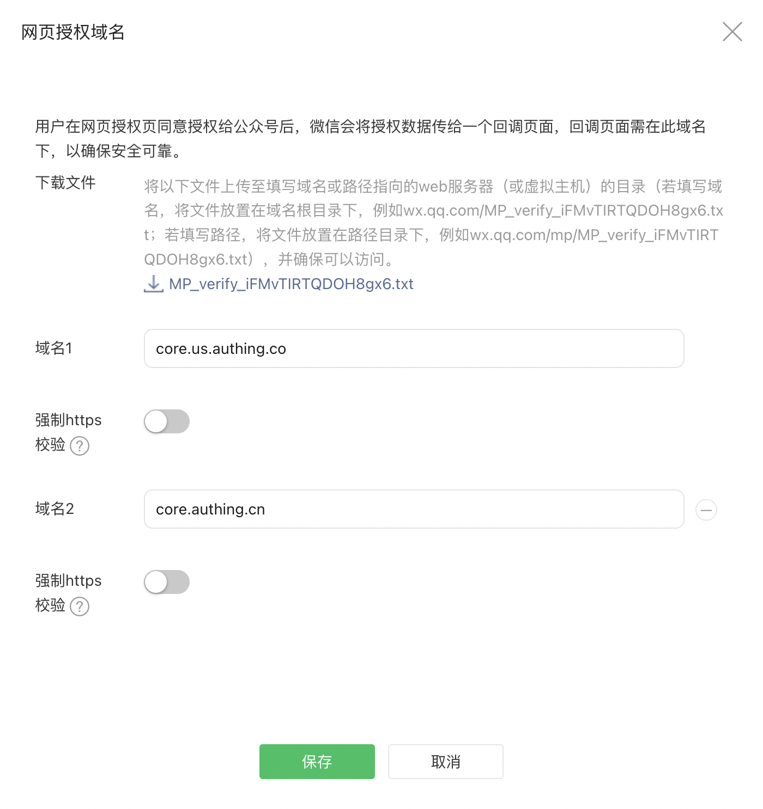

# @authing/weixin-official-account

[English](./README.md) | 简体中文

## 开发准备

- 微信公众号：前往[微信公众平台](https://mp.weixin.qq.com/) 注册
- 必须为服务号
- 必须通过微信认证
- 在微信公众平台后台的`设置与开发` -> `基本配置`页面获取开发者 ID (AppID) 和开发者密码(AppSecret)。
- 在微信公众平台后台的`设置与开发` -> `公众号设置` -> `功能设置`页面添加`网页授权域名`。域名填写 Authing 的统一回调域名：`core.authing.cn`。出于安全验证考虑，微信服务器需要和 Authing 服务器做一次请求验证，开发者需要下载`txt 文件`，并记录`文件名`和`文本内容`。



- 最后在 Authing 控制台`身份源管理` -> `社会化身份源` -> `创建社会化身份源` -> `微信` -> `微信网页授权`创建一个微信社会化身份源，并填写以下信息：

  - Unique Identifier: This is the unique ID of this connection and cannot be modified after setting.
  - Display name: the authing login form will display a {display name} login button.
  - AppID: appid provided by wechat.
  - Appsecret: appsecret provided by wechat.
  - Domain Verification Filename：Txt file name previously recorded.
  - Domain Verification File Content：Txt content recorded previously.
  - Callback URL：Your business callback link is required. The configured callback address supports the use of wildcards. For example, the callback address you configured is `https://*.example.com/*`，The following callback addresses are also allowed：`https://forum.example.com/t/topic/1234`.

## Install

Use NPM:
``` shell
npm install --save @authing/weixin-official-account
```

Use CDN:
```html
<script src="https://cdn.authing.co/packages/weixin-official-account/5.0.0/weixin-official-account.min.js"></script>
```

## Usage
### Init

``` typescript
import { AuthingWxmp } from '@authing/weixin-official-account'

const authingWx = new AuthingWxmp({
  // The unique logo of this social identity source, which you filled in when you created the wechat identity source on the Authing Console
  identifier: "authing-official-account",
  // Authing application ID
  appId: "62e7f0c91073aaba0db4d65b",
  // Authing application domain, etc: https://my-awesome-app.authing.cn
  host: "https://test-application-2022.authing.cn",
  // The specified callback link is optional. The callback address configured by the Console is used by default
  redirectUrl: 'http://localhost:3001'
})
```
### Determine whether the current environment is a wechat client
``` typescript
const isWeixin = authingWx.checkWechatUA()
```

### Initiate wechat authorization

``` typescript
// login.js
window.location = authingWx.getAuthorizationUrl()
```

### Get user information
``` typescript
// callback.js
const { ok, userInfo, message } = authingWx.getUserInfo()

if (ok) {
  console.log('userInfo: ', userInfo)
} else if (message) {
  console.log(message)
}
```

## Contribution

- Fork it
- Create your feature branch (git checkout -b my-new-feature)
- Commit your changes (git commit -am 'Add some feature')
- Push to the branch (git push -u origin my-new-feature)
- Create new Pull Request

## License

[MIT](https://opensource.org/licenses/MIT)

Copyright (c) 2019 Authing
